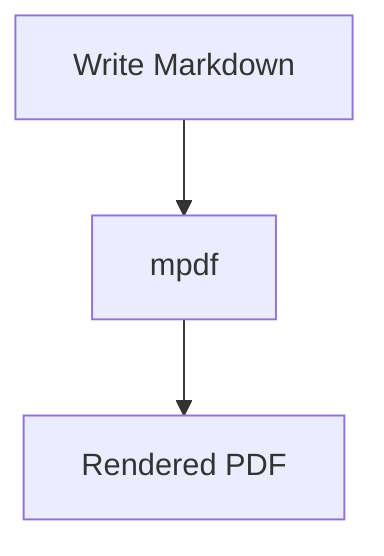

# mpdf

`mpdf` is a Windows-first command-line tool that converts Markdown files into polished PDF documents using Pandoc and XeLaTeX.

## What This Product Does

LLMs are great at generating reports, summaries, notes, and technical documents in Markdown, but raw `.md` files usually do not look presentation-ready. `mpdf` solves that by turning Markdown into a clean, professional PDF with:

- a title, author, and date
- an optional table of contents
- syntax-highlighted code blocks
- Mermaid flowcharts and diagrams rendered as images
- properly rendered math
- support for images
- a terminal progress bar during conversion
- single source line breaks preserved as line breaks in the PDF
- cleaner typography than plain Markdown viewers

This is especially useful when:

- an LLM generates a report in `.md`
- you want to share the result as a polished PDF
- you need something that looks more like a finished document than a raw text export

TL;DR: Markdown is easy for humans and LLMs to generate, and `mpdf` makes it look good enough to send, print, or archive.

## Setup

### Prerequisites

Before using `mpdf`, install these tools:

- Python 3
- Pandoc
- TeX Live with `xelatex`
- Node.js if you want Mermaid diagrams rendered via `npx`
- or Mermaid CLI globally via `npm install -g @mermaid-js/mermaid-cli`

Helpful install options on Windows:

- Pandoc: https://pandoc.org/installing.html
- Pandoc via Winget: `winget install --id Pandoc.Pandoc`
- TeX Live: https://www.tug.org/texlive/
- Python: https://www.python.org/downloads/
- Node.js: https://nodejs.org/

### Clone the Repository

```powershell
git clone https://github.com/prajasw/md2pdf.git
cd md2pdf
```

### Run It Directly

You can use the tool immediately with Python:

```powershell
python .\mpdf.py .\example.md
```

### Make `mpdf` Work Like a Global Command

If you want to run `mpdf` from anywhere in PowerShell or Command Prompt:

1. Keep `mpdf.py` and `mpdf.bat` in the same folder.
2. Add that folder to your Windows `PATH`.
3. Open a new terminal window.

Example folder:

```text
C:\tools\mpdf
```

Then place these files there:

- `mpdf.py`
- `mpdf.bat`

After adding that folder to `PATH`, you can run:

```powershell
mpdf report.md
```

## How to Use It

### Basic Command

```powershell
mpdf <input.md> [--title "..."] [--author "..."] [--date YYYY-MM-DD] [--index]
```

### Examples

Use defaults:

```powershell
mpdf report.md
```

Override title, author, and date:

```powershell
mpdf report.md --title "AI slop" --author "Prajas Wadekar" --date 2026-04-29
```

Include a table of contents:

```powershell
mpdf report.md --index
```

Use a custom Pandoc LaTeX template:

```powershell
mpdf report.md --template .\custom.tex
```

Put the title on its own page:

```powershell
mpdf report.md --title-page
```

Render Mermaid diagrams:

````markdown

````

### Defaults

If you do not supply metadata manually:

- `title` defaults to the input filename without the extension
- `author` defaults to `Prajas Wadekar`
- `date` defaults to today's date in `YYYY-MM-DD` format
- the table of contents is disabled unless you pass `--index`
- Mermaid diagrams are rendered automatically when Mermaid CLI is available through `mmdc` or `npx`
- Mermaid PNGs are rendered at 2x scale for sharper text in the final PDF

If your Markdown file already contains YAML front matter, `mpdf` respects it. CLI arguments override YAML values when both are present.

### Output

- The PDF is created in the same directory as the input file
- The output filename matches the Markdown filename

Example:

- input: `report.md`
- output: `report.pdf`

## Example Workflow

1. Ask an LLM to generate a report in Markdown.
2. Save it as something like `analysis.md`.
3. Run:

```powershell
mpdf analysis.md
```

4. Share the generated `analysis.pdf`.

That gives you a much more polished result than sending the raw Markdown file.

## Obsidian Plugin

An Obsidian plugin is included in the `obsidian-plugin` folder to easily export your active note to a PDF in your `Downloads\Obsidian_pdf` folder using `mpdf`.

To install and use it:

1. Copy the `obsidian-plugin` folder to your vault's plugins directory (e.g., `.obsidian/plugins/mpdf-export`).
2. Restart Obsidian and enable "MPDF Export" in **Settings > Community Plugins**.
3. Open a Markdown note and click the new download icon in the left ribbon, or open the command palette (`Ctrl+P`) and run **"Export active note to Downloads as PDF"**.
